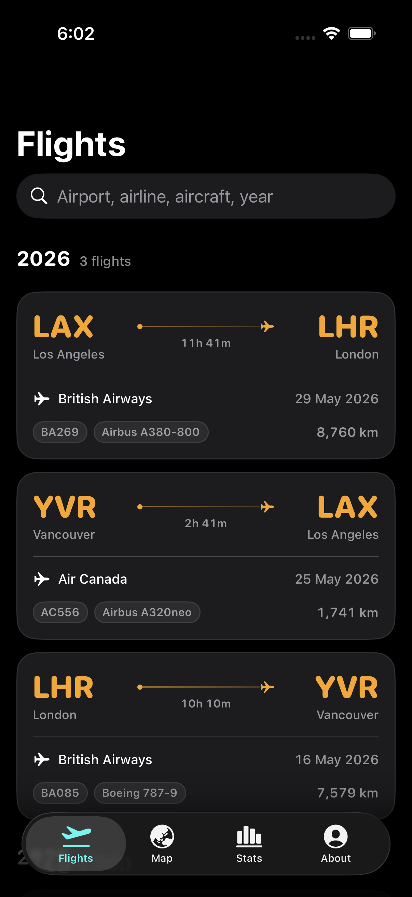
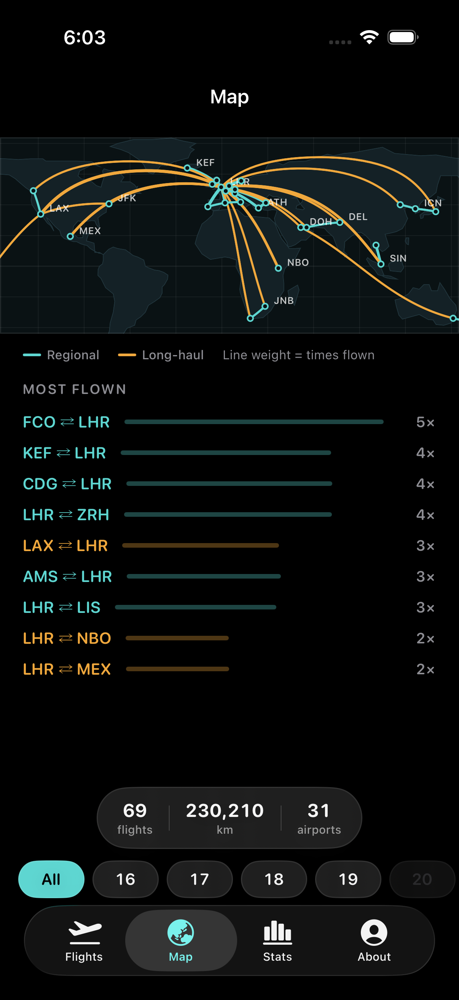
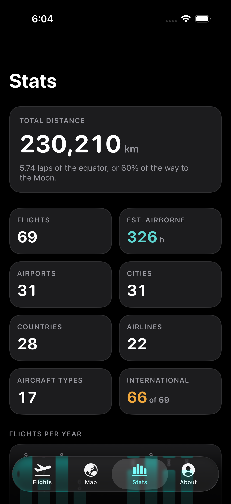
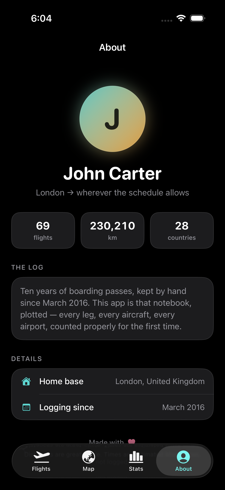
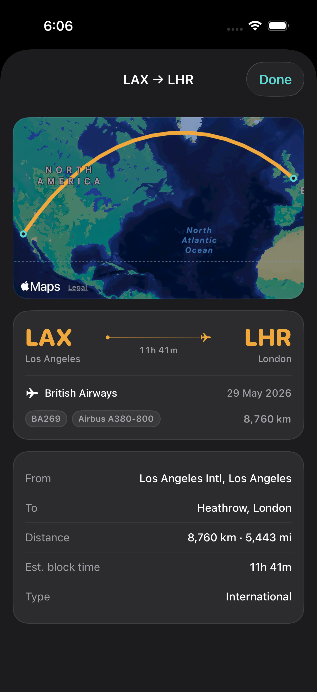
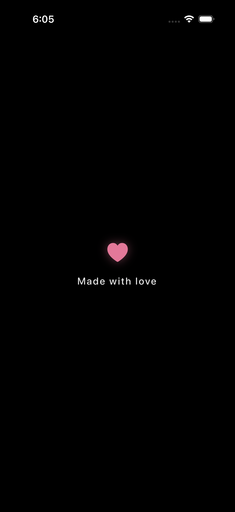

<div align="center">

# FlightLog

**A paper flight log, plotted.**

Every leg you've ever flown — mapped as true great circles, counted properly,
and readable on a plane with the wifi off.

Native SwiftUI · No dependencies · Works entirely offline

</div>

---

<div align="center">

  

  

</div>

---

## What it does

A flight log kept on paper answers "where did I go?" but never "how far, how
often, how long?". This turns the notebook into something you can actually
interrogate.

**Flights** — every leg grouped by year, big departure-board codes, colour-coded
domestic vs international. Search by airport, airline, aircraft or year. Tap any
flight for a detail sheet with its own map.

**Map** — the whole network at once, drawn as real great circles so a route bends
the way a flight does. Line weight encodes how often you flew it. Filter by year.

**Stats** — total distance in context (laps of the equator, percentage of the way
to the Moon), a year histogram, and leaderboards for airlines, aircraft, cities
and countries. Countries expand to the cities inside them.

**About** — a small profile card, because the log belongs to somebody.

## The interesting problem

The overview map is drawn with `Canvas`, not MapKit. That wasn't a stylistic
choice — MapKit genuinely cannot do it.

A well-travelled log spans a lot of longitude. The sample here reaches from Los
Angeles to Seoul: **223°**. To fit that width on a portrait phone, a Mercator map
view would need roughly **446° of latitude** — nearly two and a half times the
height the projection has. MapKit doesn't warn you about this. It silently clamps
the camera and quietly drops the far ends off both edges, and no amount of camera
tuning gets them back. `.rect`, `.camera(distance:)` and `.region` all fail the
same way.

So the overview uses a fixed equirectangular projection with hand-simplified
coastlines, and interpolates each route along the sphere before projecting it.
Same geodesics, no clamping, no network requests, and it renders identically on a
plane in flight mode.

MapKit is still used for the per-flight detail map, where a single route always
fits comfortably.

Airport labels are placed greedily, busiest first, skipping any label that would
land within 22pt of one already drawn — which is why the hub cities are named and
the crowded European cluster isn't.

## Running it

```bash
git clone https://github.com/M-Nabeegh/flight-log.git
cd flight-log
open FlightLog.xcodeproj
```

Select a simulator or your own device and press ⌘R. Requires Xcode 16+ and
iOS 17+. There are no packages to resolve — the whole thing is Foundation,
SwiftUI, MapKit and Swift Charts.

To put it on a physical iPhone you'll need to set your own signing team under
**Signing & Capabilities**, and change the bundle identifier to something unique.

## Using your own flights

The repo ships with a **sample log — 69 invented flights across 28 countries**.
It is not a real person's travel history. Replace it with yours:

`tools/make-sample-data.js` shows the shape. Edit the airport table and the
flight table, then regenerate:

```bash
node tools/make-sample-data.js
```

That rewrites `FlightLog/FlightData.swift`. Distances are computed for you as
great-circle kilometres; you only supply date, route, airline, flight number and
aircraft.

To use your own photo on the About tab, add an image named `portrait` to
`Assets.xcassets` — the view prefers it and falls back to a monogram when it's
absent. Edit the `Profile` enum at the top of `AboutScreen.swift` for the name
and details.

## How the numbers are made

Distances are **great-circle**, airport to airport, in kilometres.

Times are **estimated block times**, not logged: great-circle distance ÷ 780 km/h
cruise, plus 27 minutes for taxi, climb and descent. This lands within a few
minutes of published schedules across both short-haul and long-haul, but it is an
estimate and the app says so wherever it's shown.

## Layout

```
FlightLog/
├── Model.swift          Flight, Airport, Route + every derived statistic
├── FlightData.swift     The log itself (generated)
├── FlightsScreen.swift  Year-grouped list, search, detail sheet
├── MapScreen.swift      Overview map, year filter, route ranking
├── WorldMap.swift       Canvas projection, geodesics, label placement
├── WorldOutline.swift   Simplified coastlines (generated)
├── StatsScreen.swift    Tiles, histogram, leaderboards, superlatives
├── AboutScreen.swift    Profile card
├── SplashScreen.swift   Launch animation
└── Theme.swift          Palette, type scale, shared components
```

Dark and light are both first-class — the app follows the system appearance, and
the map has a separate palette for each.

## Licence

MIT. See [LICENSE](LICENSE).
